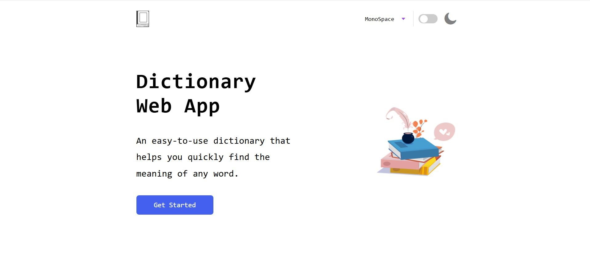
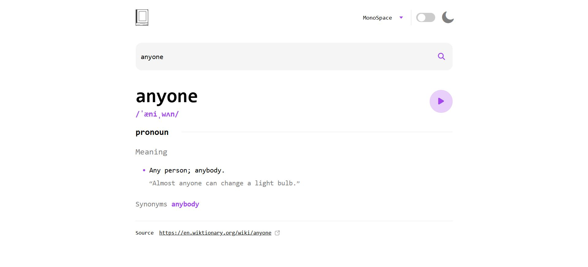
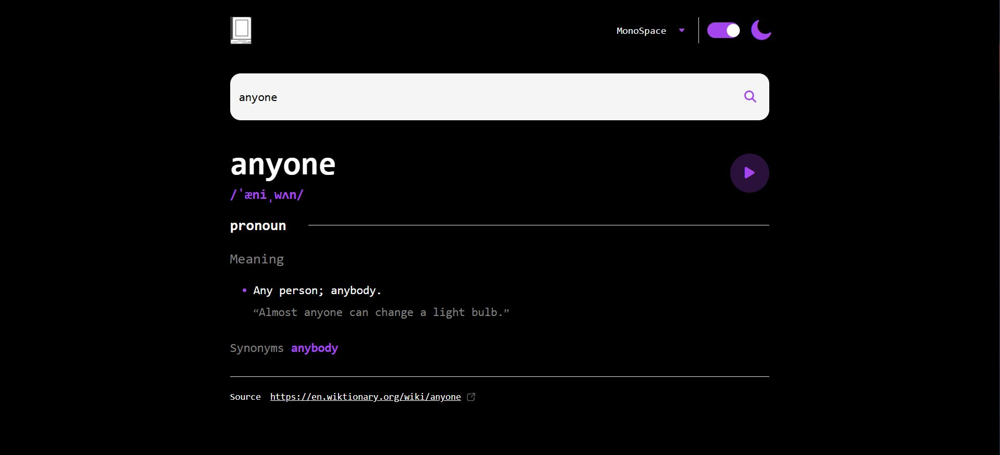
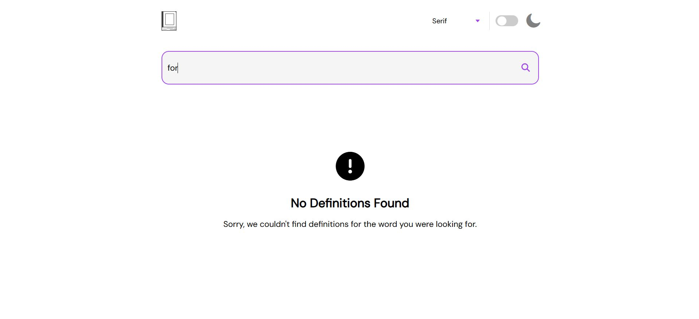
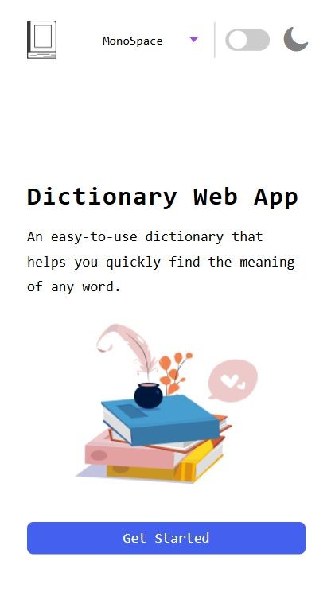
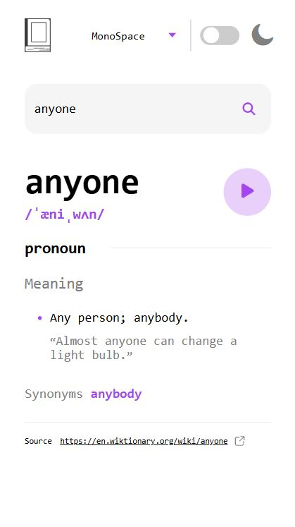

# DictionaryWebApp

LIVE: https://dictionary-web-app-gabrielval0911.netlify.app/

Dictionary Web App is a simple and intuitive web application that allows users to input an English word and instantly receive its definition using a Dictionary API(https://dictionaryapi.dev/). It's a helpful tool for quickly understanding the meaning of English words.

🔧 Features:

Search for words using the input field

Play the audio file for a word when it's available

Switch between serif, sans serif, and monospace fonts

Switch between light and dark themes

Built entirely with HTML, SCSS, and JavaScript

🎨 Design:

The UI/UX design was adapted from Frontend Mentor.(https://www.frontendmentor.io/challenges/dictionary-web-app-h5wwnyuKFL)

🖼️ Assets:

All images and icons are free-to-use and sourced from:

Vecteezy

Unsplash

🌐 API: https://dictionaryapi.dev/

